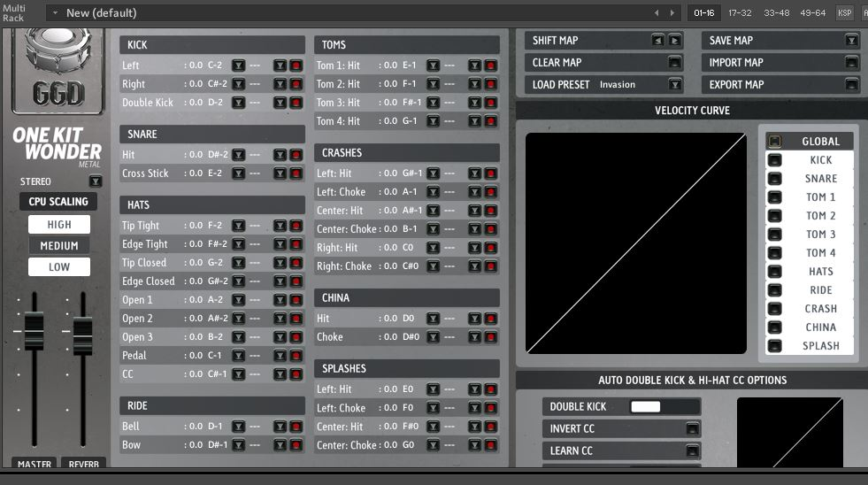

# MidiNoteNameGen

[Download the tool](https://raw.githubusercontent.com/pattersonjosh15/MidiNoteNameGen/main/download/MidiNoteNameGen.exe)

A simple tool that accepts an nka file (drum mapping preset for the GGD Kits) and 
produces a Midi Note Name file (a txt file that Reaper uses to show custom names within
the piano roll). Currently works for:
- Invasion
- The PIV Matt Halpern Kit
- The Original Matt Halpern Signature Pack
- OKW Metal
- OKW Aggressive Rock
- OKW Architects

These are the kits that I own currently and I do plan on acquiring more in the 
future.  However if you would like to see functionality for kits not listed here read 
the "How To Help" section (no money involved :D )

# Presets

presets

[Download the presets](https://raw.githubusercontent.com/pattersonjosh15/MidiNoteNameGen/tree/main/presets)

If you don't want to mess with the tool I have included some mappings 
and corresponding reaper midi note name files that you can download.

These presets contain the default mappings that come with these kits 
(which are a bit wierd in my opinion) and a more optimized version where 
kit sections are grouped nicely.

# If you want to help

If you want to see functionality for GetGoodDrum libraries that are not listed above or 
just help me expand the tool, I would be more that happy to add them. All you have to do is 
open the desired library and:
- Go to the settings section
- Make sure all articulations are assigned to a Midi note
- Hit 'Export Map' and save the file
- Take a screenshot of the settings page
- Send the exported file (it will be an .nka file) and screenshot over to me at joshpattdev@gmail.com  

Here is what the screen shot should look like,  

